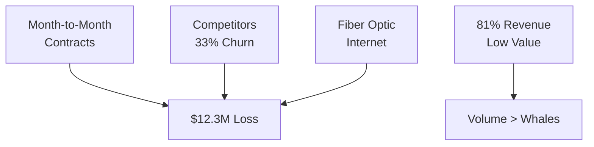

# Customer Churn Analysis

**🚀 Quick Start**

**1 Install dependencies**
pip install pandas matplotlib seaborn numpy

**2 Place telecom_customer_churn.csv in same folder**
**3 Run (best in Jupyter/Colab)**
python customer_churn_prediction.py

**executive-ready charts generated automatically!**

## 📋 Overview
Comprehensive telecom customer churn analysis that reveals:

> **"Competitors cause 33% of churn. Month-to-Month contracts = #1 revenue risk. Retention is a volume game, not whale hunting."**

**Global Churn Rate:** 26.6%

| Key Output | Business Value |
|------------|----------------|
| Churn reason pie + bars | Root cause analysis |
| Revenue hotspots | $ loss by customer trait |
| NVF vs NCRF scatter | Customer segmentation |
| Lift analysis | Feature risk ranking |
| Revenue dashboard | Strategic priorities |

## 📊 Core Metrics

### **NVF (Normalized Value Factor)** - Y-Axis
```
(Monthly Charge + Tenure + Referrals) normalized 0-1
≥0.6 = "High Value" customer
```

### **NCRF (Normalized Churn Risk Factor)** - X-Axis  
```
Service feature risk score (Contract, Online Security, etc.)
≥0.5 = "Low Risk/Safe"
```

## 🗄️ Data Requirements
**File:** `telecom_customer_churn.csv` (~7K rows, download from Kaggle)

**Essential columns:**
```
Customer ID, Monthly Charge, Tenure in Months, Customer Status
Churn Reason, Contract, Offer, Internet Type, Online Security
Total Revenue, Age, Number of Referrals
```

## 📁 File Structure
```
├── customer_churn_prediction.py  # Main analysis (28K lines)
├── telecom_customer_churn.csv    # REQUIRED dataset
├── README.md                    # This file
└── outputs/                     # Optional: save charts
```

## 🎯 Generated Visualizations

### 1. **Churn Root Cause Analysis**
```
Competitors: 11.9% (devices + offers)
Customer Support: 5.9% (attitude/expertise)
Network: 1.5%, Pricing: 2.6%
```


### 2. **Revenue Hotspots** (Top $ Risk)
```
1. Contract: Month-to-Month → $12.3M loss
2. Online Security: No → $8.7M  
3. Fiber Optic → $7.2M
```


### 3. **Customer Segmentation Matrix**
| Value → Risk | **Safe** | **@ Risk** | **Churned** |
|-------------|----------|------------|-------------|
| **High** | Strategic VIP | 🎯 **Priority 1** | Revenue Leak |
| **Low**  | Mass Market | Volume Risk | Volume Loss |

### 4. **Feature Lift Analysis**
**vs Global 26.6% churn baseline**

## 💡 Key Insights



**Action Items:**
```
✅ Fix Month-to-Month retention offers
✅ Match competitor devices/pricing  
✅ Service features = neutral (No/Yes same churn)
✅ Protect low-value volume (81% revenue)
```

## ⚙️ Customization

### Test Thresholds
```python
# Default: NVF=0.6, Risk=0.5
df_test = simulate_thresholds(0.5, 0.4)  # More aggressive
print(df_test)
```

### Color Theme (Dark Mode Optimized)
```python
facecolor = "#5f6f63"  # Background
churn    = "#f7f4d5"  # Yellow
stay     = "#d3969c"  # Pink
```

## 🔧 Troubleshooting

| Issue | Solution |
|-------|----------|
| `FileNotFoundError` | Download CSV from Kaggle |
| `No plots` | Run in Jupyter: `%matplotlib inline` |
| `KeyError` | Verify CSV column names match |
| `Slow` | Normal (~30s for 7K rows) |

## 🛠️ Technical Specs
- **Python 3.7+**
- **No ML model** - Pure EDA + segmentation
- **Jupyter/Colab optimized**
- **Hard-coded columns** - Easy to modify

## 📈 Sample KPI Output
```
High Value / Stayed @ Risk: 1,231 accounts, $108K/mo (18.7%)
Low Value / Churned: 523K accounts, $48K/mo (42.4%)
```

## 📄 License
[](https://opensource.org/licenses/MIT)

**Made in Bengaluru 🇮🇳 by Poorani M**  
*February 2026*

---

## 🎉 Next Steps
1. **Run now** → Instant retention roadmap
2. **Adjust thresholds** → Optimize segments
3. **Export charts** → `plt.savefig('dashboard.png')`
4. **Build ML** → Use segments as features

**💎 Value:** Raw CSV → Executive dashboard in 30 seconds
```

***

**Copy above text → Create `README.md` → Done! 🚀**
